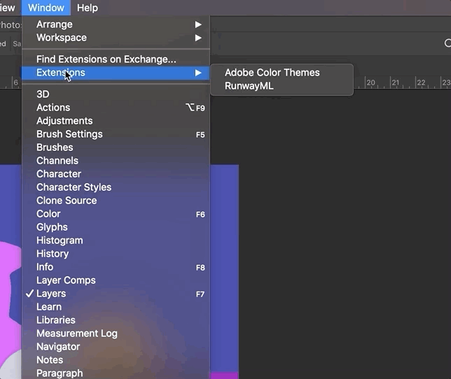
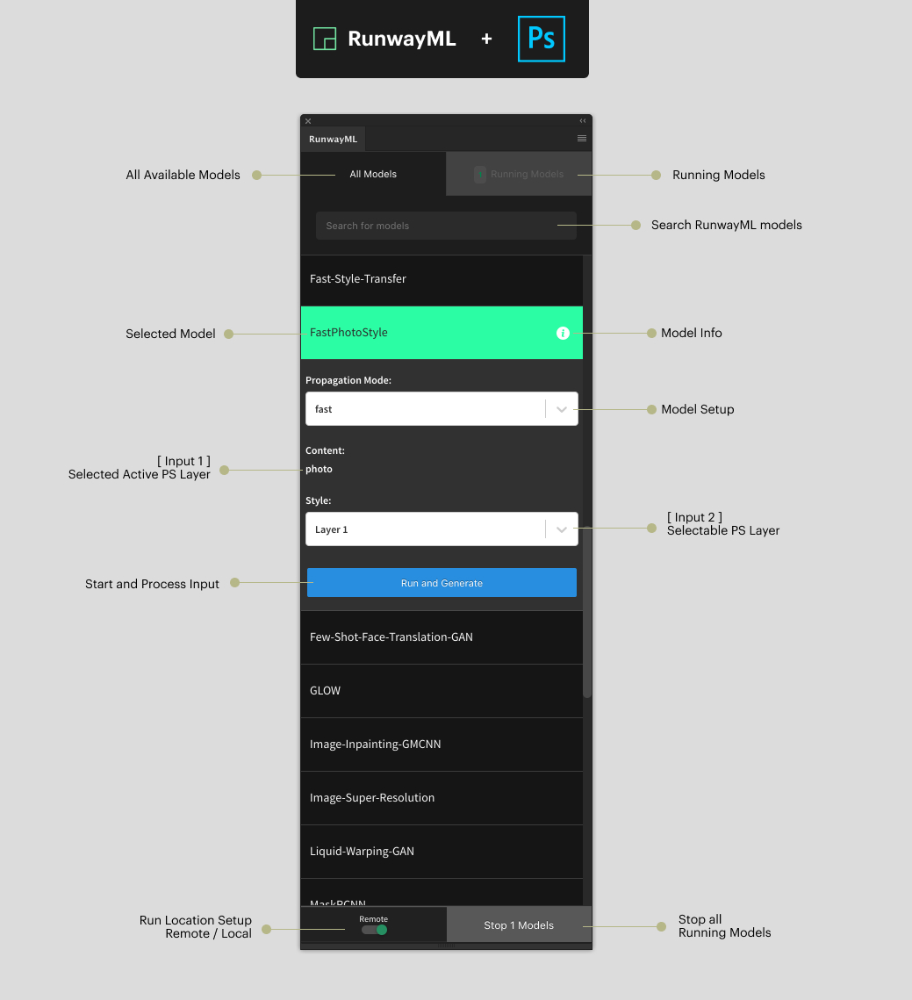

# RunwayML for Adobe Photoshop

[](https://open-app.runwayml.com/)


Access [RunwayML](https://runwayml.com) directly from [Adobe Photoshop](https://www.adobe.com/photoshop‎): You can use this plugin to generate images, apply style transfer to your photos, get depth estimation from 2D images, generate new pieces of texts to your designs and more.


## Prerequisites

* [RunwayML](https://runwayml.com/): Download the latest release of [RunwayML](https://runwayml.com/download) and sign up for an account. Visit our [installation guide](https://learn.runwayml.com/#/getting-started/installation) for more details. If you encounter any issues installing RunwayML, feel free to contact us through the [support page](https://support.runwayml.com).

* [Adobe Photoshop](https://www.adobe.com/products/photoshop/free-trial-download.html): Adobe Photoshop CC 2019 +

## Installation

1) [Download the latest version of the plugin](https://github.com/runwayml//RunwayML-for-Photoshop/releases).

2) Set debug mode:

**Windows:** Open regedit > HKEY_CURRENT_USER/Software/Adobe/CSXS.9, then add a new entry PlayerDebugMode of type string with the value of "1".

**Mac (In the Terminal):** ``` $ defaults write com.adobe.CSXS.9 PlayerDebugMode 1 ```

More information is available [here](https://github.com/Adobe-CEP/CEP-Resources/blob/master/CEP_9.x/Documentation/CEP%209.0%20HTML%20Extension%20Cookbook.md#debugging-unsigned-extensions).

3) Install the plugin:

Unzip the plugin and copy the entire `RunwayML` directory to Photoshop Extension directory.

**Windows:** C:\Program Files\Common Files\Adobe\CEP\extensions

**Mac:** ~/Library/Application Support/Adobe/CEP/extensions

More information is available [here](https://github.com/Adobe-CEP/CEP-Resources/blob/master/CEP_9.x/Documentation/CEP%209.0%20HTML%20Extension%20Cookbook.md#extension-folders).

4) Make sure `Runway.app` is running and you're signed in.

## Getting Started

In order to use this plugin, you'll need to have [RunwayML](https://runwayml.com/) and Photoshop opened:

1) Open RunwayML and sign in with your account.

2) In Photoshop you'll find the Extension panel under ```Window > Extensions > RunwayML```.



### Using the RunwayML Panel

Once the plugin is installed, you can browse and run models directly from the RunwayML panel window. The panel is split into four sections: the (1) Model Selection, (2) Input, (3) Output, and (4) Run Options.



### (1) Model Selection
  
At the `All Models tab`, you can select the RunwayML model that you'd like to use, and select settings for initializing your model. To learn more about the capabilities and use-cases of different models in RunwayML, [watch our tutorial on discovering RunwayML models](https://www.youtube.com/watch?v=ePIRExcanjg).

### (2) Input

Choose the inputs that you want to process with your model. Currently, the following input data types are supported:

* [`image`](https://sdk.runwayml.com/en/latest/data_types.html#runway.data_types.image)
* [`segmentation`](https://sdk.runwayml.com/en/latest/data_types.html#runway.data_types.segmentation)
* [`category`](https://sdk.runwayml.com/en/latest/data_types.html#runway.data_types.category)
* [`number`](https://sdk.runwayml.com/en/latest/data_types.html#runway.data_types.number)
* [`boolean`](https://sdk.runwayml.com/en/latest/data_types.html#runway.data_types.boolean)

#### Image Inputs

Use the Dropdown item to select the layer you want to process. 
If you want to process the whole art-board, Choose the option `Artboard`

#### Segmentation Inputs

For models that take `Segmentation` data type as input, use the Dropdown item to select the layer you want to process.
If you want to proccess the whole Artboard, Choose the option `Artboard`

#### Text Inputs

Use the text area provided in the plugin.

### (3) Output

The model's output will be displayed in the Artboard as a new layer.

### (4) Run

Once you click `Run and Generate`, RunwayML will start `running` and `processing` the input of the selected model. Once the model is `running`, you can click `Re-Generate` to re-run inference on the current inputs using the selected model.

#### Run Options

**Run Location**: Choose whether to run the model locally (`Local`) or in RunwayML's cloud infrastructure (`Remote`). When running models in RunwayML's cloud infrastructure, you'll be running them on fast GPU enabled computers. When running models locally, you'll need to download and install them individually. You can currently download models locally only through the RunwayML application. Go to your `Settings` in RunwayML to view the currently installed models. Once you have installed a model locally, you can start the model from the RunwayML for Photoshop. 

[Check out this guide](https://learn.runwayml.com/#/how-to/run-models-locally) to learn more about how to install models locally.

## Development

### Debugging

Open localhost:8088 in Google Chrome to see the `devtools` / debugging console. You can refresh the plugin like a website (CMD+R). Note that host .jsx files will not update this way! To refresh those, close the plugin panel and re-open.

## Contributing

This is still a work in progress. Contributions are welcomed!

## License

MIT
